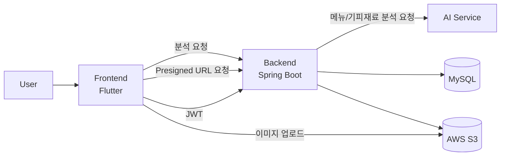

  

<h1 align="center">SafePlate</h1>

  언어와 문화 장벽이 있는 환경에서도, 개인/팀의 기피 재료를 반영해 더 안전한 메뉴 선택을 돕는 서비스

  <a href="https://github.com/GDGoC-CAU-Team-9/frontend">Frontend</a>
  ·
  <a href="https://github.com/GDGoC-CAU-Team-9/backend">Backend</a>

---

## 프로젝트 소개
SafePlate는 알러지, 종교, 식습관, 개인 기호 등 다양한 기피 식재료를 반영해 소통이 어려운 상황에서 메뉴판을 분석하고,
사용자가 안심하고 음식을 선택할 수 있도록 돕는 프로젝트입니다.

- 개인 프로필 기반 기피 재료 관리
- 팀 단위 기피 재료 통합 분석
- 메뉴 이미지 업로드 후 AI 분석
- 분석 기록 저장/조회

## 시스템 개요

## Frontend 분석
Flutter 기반 앱으로 실제 사용자 흐름 중심 UX를 구현했습니다.

- 인증: 회원가입/로그인/JWT 저장
- 프로필: 기피재료 자연어 입력 및 저장/목록 관리
- 팀: 팀 생성/참여/상세 조회
- 분석: 메뉴판 이미지 업로드, 결과 시각화
- 기록: 분석 기록 조회/삭제
- 다국어: `ko`, `en`, `es`, `fr`, `ja`, `zh`

주요 기술
- `Flutter`, `Dart`
- `flutter_riverpod`, `go_router`
- `dio`, `flutter_secure_storage`
- `easy_localization`

## Backend 분석
Spring Boot 기반 REST API 서버로 인증, 파일 처리, 분석, 기록 기능을 제공합니다.

핵심 구성
- 인증/회원: `/auth`, `/members`
- 기피재료: `/avoid-items`
- 분석/기록: `/restaurant/search`, `/histories`
- 팀 기능: `/teams`
- 파일 업로드: `/files` (Presigned URL + 상태 업데이트)

주요 기술
- `Spring Boot`, `Spring Security`, `JPA`
- `MySQL`, `Liquibase`
- `OpenFeign` (AI 연동)
- `AWS S3` (이미지 업로드)
- `JWT` 인증

## 화면 미리보기
<table>
  <tr>
    <td align="center"><b>로그인</b></td>
    <td align="center"><b>언어 설정</b></td>
  </tr>
  <tr>
    <td></td>
    <td></td>
  </tr>
  <tr>
    <td align="center"><b>분석 기록</b></td>
    <td align="center"><b>분석 결과</b></td>
  </tr>
  <tr>
    <td></td>
    <td></td>
  </tr>
  <tr>
    <td align="center"><b>기피재료 관리</b></td>
    <td align="center"><b>사이드바</b></td>
  </tr>
  <tr>
    <td></td>
    <td></td>
  </tr>
</table>

---

  Built by GDGoC CAU Team 9

